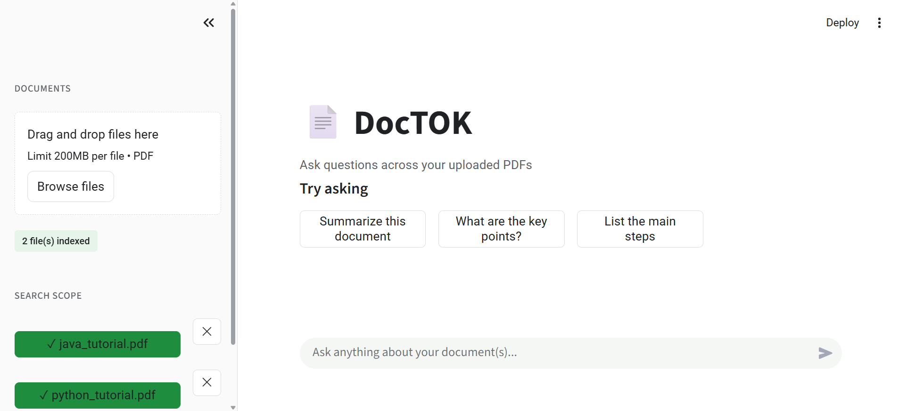
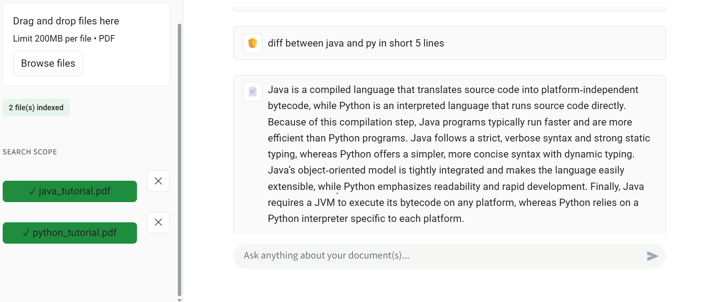
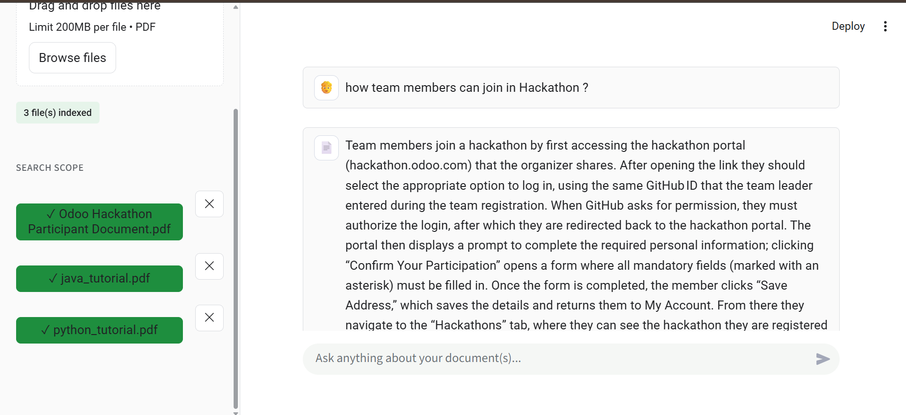

# 📄 DocTOK

**Ask questions across multiple PDFs, get grounded answers with citations — powered by RAG and Groq.**

🔗 **Live Demo:** [https://your-app-url.streamlit.app](https://doctokk.streamlit.app/) 


---

## ✨ What it does

DocTOK is a Retrieval-Augmented Generation (RAG) chat app that lets you upload one or more PDFs and ask natural-language questions about them. Answers are generated **only from your documents** — with page-level citations, so you can always verify the source.

- 📚 **Multi-PDF support** — upload several documents into one searchable knowledge base
- 🎯 **Per-file search scope** — toggle which PDFs are included in a query, or remove one entirely
- 📖 **Grounded, cited answers** — the model answers strictly from retrieved context, never guesses
- ⚡ **Streamed responses** — answers appear token-by-token instead of a long wait
- 🔁 **Resilient to rate limits** — rotates across multiple Groq API keys automatically
- 🧠 **Smart retrieval** — query rewriting for vague questions, automatic fallback for broad asks like "summarize this"

---

## 🖥️ Screenshot

> 
> 
> 
---

## 🏗️ How it works

```
PDF Upload ─▶ Chunking ─▶ Embedding (MiniLM) ─▶ ChromaDB (cosine similarity)
                                                        │
User Question ─▶ Query Rewrite ─▶ Vector Search ◀───────┘
                                        │
                              Relevance Filtering
                                        │
                         Context ─▶ Groq LLM (streamed)
                                        │
                              Answer + Page Citations
```

1. **Ingestion** — PDFs are parsed, split into chunks, embedded locally with `sentence-transformers/all-MiniLM-L6-v2`, and stored in a persistent ChromaDB collection (cosine distance).
2. **Retrieval** — the user's question is optionally rewritten for clarity, embedded, and matched against chunks (optionally scoped to selected files via metadata filtering). Weak matches below a relevance threshold are discarded. Broad questions ("summarize this", "key points") fall back to a representative spread of the document instead of a narrow similarity match.
3. **Generation** — retrieved chunks are passed as context to Groq (`openai/gpt-oss-120b`), which is instructed to answer **only** from that context and say so explicitly if the answer isn't present. Responses stream token-by-token.
4. **Citations** — every answer links back to the specific PDF and page number(s) it was drawn from.

---

## 🚀 Getting started

### 1. Clone and set up a virtual environment

```bash
git clone <your-repo-url>
cd doctok
python -m venv .venv
.venv\Scripts\activate      # Windows
source .venv/bin/activate   # macOS/Linux
```

### 2. Install dependencies

```bash
pip install -r requirements.txt
```

### 3. Add your API keys

Create a `.env` file in the project root:

```env
GROQ_API_KEY_1=gsk_xxxxxxxxxxxxxxxxxxxx
GROQ_API_KEY_2=gsk_xxxxxxxxxxxxxxxxxxxx
GROQ_API_KEY_3=gsk_xxxxxxxxxxxxxxxxxxxx
```

Multiple keys are optional but recommended — the app rotates across them automatically if one hits a rate limit. Get free keys at [console.groq.com](https://console.groq.com).

### 4. Run it

```bash
streamlit run app.py
```

Open `http://localhost:8501`, upload a PDF, and start asking questions.

---

## ⚙️ Configuration

Key settings live in `config.py`:

| Variable | Purpose | Default |
|---|---|---|
| `MODEL_NAME` | Groq model used for answers | `openai/gpt-oss-120b` |
| `EMBEDDING_MODEL` | Local embedding model | `all-MiniLM-L6-v2` |
| `CHUNK_SIZE` / `CHUNK_OVERLAP` | Text splitting | `500` / `100` |
| `TOP_K` | Chunks retrieved per query | `8` |
| `SCORE_THRESHOLD` | Minimum relevance score (`retriever.py`) | `0.35` |

Set `DOCTOK_DEBUG=1` in your environment to print retrieval scores/decisions to the console for tuning.

---

## 📁 Project structure

```
doctok/
├── app.py                     # Streamlit UI
├── config.py                  # Central configuration
├── requirements.txt
├── .streamlit/
│   └── config.toml            # Light theme (green accent)
└── modules/
    ├── document_processor.py  # PDF upload → chunk → index pipeline
    ├── pdf_loader.py          # PDF text extraction
    ├── text_chunker.py        # Chunking logic
    ├── embeddings.py          # Cached embedding model
    ├── vector_store.py        # ChromaDB client, storage, per-file delete
    ├── retriever.py           # Query rewriting + relevance-filtered search
    └── rag_chain.py           # Prompting, Groq key rotation, streaming
```

---

## ☁️ Deployment (Streamlit Community Cloud)

1. Push this repo to GitHub (`.gitignore` already excludes `.env`, `chroma_db/`, and uploaded files).
2. Go to [share.streamlit.io](https://share.streamlit.io) → **New app** → point at your repo, `app.py` as the entry point.
3. In **Settings → Secrets**, add:
   ```toml
   GROQ_API_KEY_1 = "gsk_..."
   GROQ_API_KEY_2 = "gsk_..."
   ```
4. Deploy. Done — `app.py` automatically mirrors Streamlit secrets into environment variables at startup, so no code changes are needed between local and hosted environments.

---

## 🧰 Tech stack

- **[Streamlit](https://streamlit.io)** — UI
- **[Groq](https://groq.com)** — LLM inference (`openai/gpt-oss-120b`)
- **[ChromaDB](https://www.trychroma.com)** — vector store (cosine similarity)
- **[LangChain](https://python.langchain.com)** — document/embedding orchestration
- **[sentence-transformers](https://www.sbert.net)** — local embeddings (`all-MiniLM-L6-v2`)

---

## 📄 License

MIT — see [LICENSE](LICENSE).
